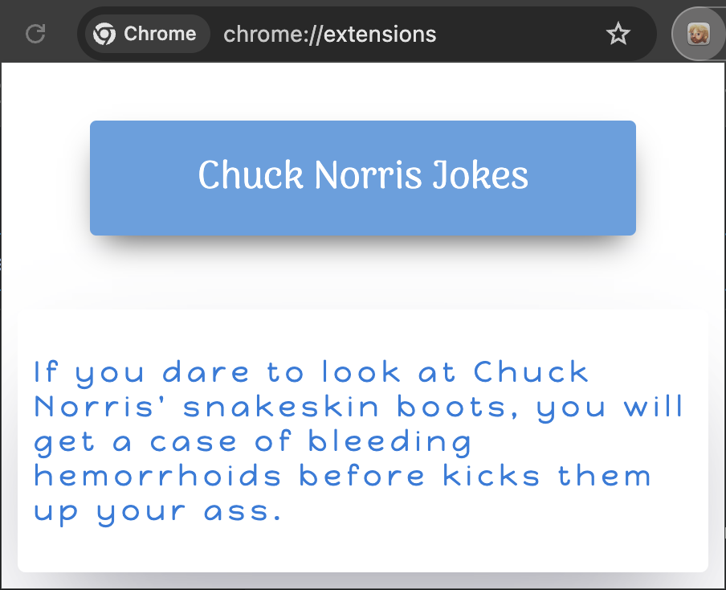

# Chuck Norris  Jokes

It's a simple project for “Google Chrome Extensions” as a kind of exercise for HTML, CSS and JS (Knowledge from [ZTM][3] courses). Feel free to clone it and play around with it.

> [!NOTE]  
> It is not perfect and only as an simple example for Chrome Extension.

## Overview

This Chrome extension, "Chuck Norris Jokes," fetches and displays a random Chuck Norris joke from the [chucknorris-API][2]. The extension provides users with an interactive experience where they can load new jokes with a button click, with dynamic text updates to enhance engagement.

## Running this extension

1. Clone this repository.
2. Load directory `./extension` in Chrome as an [unpacked extension][1].
3. Open the Extension menu and click the extension named "Chuck Norris Jokes".
4. Click on the extension's icon to request new joke.

## Useful references

- [Beautiful CSS box-shadow examples](https://getcssscan.com/css-box-shadow-examples)
- [GitHub - chrome-extensions-samples](https://github.com/GoogleChrome/chrome-extensions-samples)
- [The 55 Best CSS Button Hover Effects You Can Use Too](https://www.sliderrevolution.com/resources/css-button-hover-effects/)
- [GitHub - [Markdown] An option to highlight a "Note" and ...](https://github.com/orgs/community/discussions/16925)
- [copyicon - chuck+norris](https://copyicon.com/icons?keyword=chuck+norris)

[1]: https://developer.chrome.com/docs/extensions/mv3/getstarted/development-basics/#load-unpacked
[2]: https://api.chucknorris.io/
[3]: https://zerotomastery.io/community/